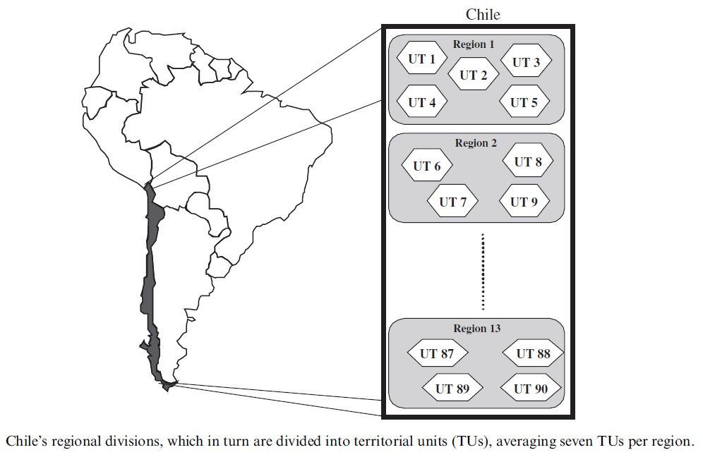

###A combinatorial auction improves school meals in Chile: a case of OR in developing countries

###(Una subasta combinatoria mejora las comidas escolares en Chile: un caso de OR en países en desarrollo)
######*Pag1*
####Abstract:

El Estado de Chile ofrece servicio de comidas esenciales en las escuelas para los estudiantes de bajos ingresos. Junta Nacional de
Auxilio Escolar y Becas, la institución encargada de cubrir 1.300.000 niños arrienda el servicio de comida de empresas privadas

Se ha desarrollado un modelo de programación lineal entera para asignar los contratos de alimentación en un proceso conocido como "combinatorial auctions".

El modelo resultante, el cual es NP-duro, lleva a mejoras significativas
en la eficiencia y también contribuyeron a hacer el proceso más transparente.

Los resultados son aparentes en mejoras sustanciales en la calidad y cobertura del servicio, e importantes ahorros para el país, que son equivalentes a la alimentación de 300.000 niños más. 

Para la función objetivo de este problema, se analizó varias opciones a considerar diferentes tipos de beneficios sociales.

---

####1 Introducción

"No hay tal cosa como un almuerzo gratis", va un dicho muy querido por los economistas. Nada es gratis en esta vida. Pero Junta Nacional
######*Pag2*
de Chile responsable de becas y ayudas escolares (Junta Nacional de Auxilio Escolar y Becas (JUNAEB)), es una excepción que confirma la regla, ofreciendo desayunos y almuerzos diarios para 1.300.000 niños en edad escolar, con un presupuesto de US $ 180 millones.
Directores JUNAEB y académicos con la Universidad de Departamento de Ingeniería Industrial de Chile han desarrollado y aplicado una herramienta de investigación operativa que ha permitido ahorrar US $ 40 millones al año, lo que mejora la calidad de la ración y la cobertura de los servicios. JUNAEB aplica esta herramienta por primera vez en 1997 y en cada subasta desde entonces.

Chile es un país en desarrollo con 15 millones de habitantes. El crecimiento económico anual promedio durante la década de 1990 fue del 6,3%, lo que aumentó el ingreso per cápita de US $ 2.768 en 1990 a US $ 4.603 en el año 2000. Durante este mismo período, la pobreza se redujo de 39% a 20%, y del 50% al 30% en el caso de los menores de 18 años de edad. La cobertura de la escuela primaria (niños de 6 a 14 años de edad) ha alcanzado el 97%, mientras que la matrícula de la escuela secundaria (jóvenes de 15 a 18 años) es del 84%.
El analfabetismo en Chile se sitúa en el 4,4%. En resumen, Chile ha avanzado significativamente en la última década, lo que ha permitido mejorar las condiciones sociales de los más pobres de su pueblo; sin embargo, 30% de los niños siguen viviendo en la pobreza.

En este contexto, el aumento del 70% en el gasto estatal en educación durante la década es comprensible. Estrategia de desarrollo de Chile se basa en parte en la mejora de la educación para los niños más pobres. El propósito de la JUNAEB, una agencia pública asociada con el sector de la educación, es el de proporcionar a los niños de los hogares de menores ingresos con las comidas en la escuela, durante el día escolar (desayuno, almuerzo y cena). Este servicio nacional, siempre sin costo alguno para los estudiantes, ha sido crucial en la reducción de las tasas de abandono escolar y en la mejora de los logros académicos de los niños que reciben estos beneficios.

Presupuesto anual de la JUNAEB para todos los programas sociales es de US $ 150 millones (año 2000), con US $ 138 millones gastados en el programa de alimentación escolar (Programa de Alimentacio' n Escolar (PAE)), que beneficia a 1.200.000 niños. La JUNAEB tiene otros programas, por ejemplo proporcionando anteojos a los estudiantes, a un costo de US $ 3 millones por año. La JUNAEB es también responsable de programas de alimentos de subasta asocian con otras dos agencias, JUNJI e INTEGRA, que son responsables por el cuidado de niños (bebés y niños de 4 a 5 años). En conjunto, estas dos agencias sirven 126.000 niños con un presupuesto anual de US $ 46 millones. Estas subastas son muy importantes para el país, no sólo por los montos involucrados, sino también por la importancia social del servicio que trate: el suministro de alimentos a los niños más vulnerables de Chile que estudian en las escuelas.

La JUNAEB ha otorgado concesiones a estos servicios de alimentación a empresas privadas a través de subastas públicas desde 1980. El número de empresas de licitación ha aumentado entre tres en 1980 a 35 en 2002. El país está dividido en 90 unidades territoriales (TUS) y cada uno subastas JUNAEB fuera de servicio a 30 de ellas, con contratos de una duración de 3 años. 
Estas subastas son muy complejas. En primer lugar, los diferentes tipos de alimentos se deben proporcionar según la edad de los niños, la escuela y su situación económica. La realidad de las diferencias regionales también deben tenerse en cuenta, que implica acceso a la escuela y los hábitos alimentarios. Por otra parte, estos
subastas implican contratos de 3 años. Por último, debemos hacer frente a presupuestos muy ajustados, por un lado, y la necesidad de maximizar la calida del servicio en el otro.
Antes de 1997, los contratos fueron asignados por un comité de aplicación bastante rudimentario y criterios subjetivos. Básicamente, una serie de filtros basados en criterios financieros y técnicos eran aplicada, que eliminó algunas ofertas. Por lo tanto, se utilizó un método iterativo para eliminar posibles opciones hasta obtener una solución, supuestamente de buena calidad. Dada la complejidad de 
######*Pag3*
subastas, esta solución era, evidentemente, no muy eficiente y, peor aún, les permite todo tipo de pesión en el comité. En las subastas de este ámbito, es fundamental tener objetivos, procedimientos transparentes para reducir las posibles presiones, sean legítimos o no, y la fuerza
empresas para competir en calidad y precios (Klemperer, 2002).
Cada empresa participante en una subasta ofrece una oferta técnica y varios financiera. Cada oferta económica incluye un conjunto de unidades de formación y un conjunto de precios de la oferta de servicios. Cada
oferta económica es aceptada o rechazada en su conjunto y las empresas pueden proporcionar todas las ofertas financieras si así lo desean. Libertad para ofrecer en diferentes paquetes de unidades de formación, dada la subasta de una naturaleza combinatoria.

En términos técnicos, se desarrolló un modelo de programación entera mixta en la que las ofertas seleccionadas sean las variables de decisión. Este problema es difícil de resolver. En términos matemáticos, se pertenece a la clase NP-duro e incluye estructuras combinatorias clásicos: **la puesta a punto de cobertura problema, el problema de la mochila, y el problema de instalación de ubicación uncapacitated**. Usamos técnicas de optimización sofisticados para resolver casos reales y el sistema se ejecuta en una ordenador personal, utilizando el programa de optimización de CPLEX.
La metodología consiste en analizar muchos escenarios, diferenciados por el costo, calidad, precio bandas, menús y otros aspectos operativos. Utilizando el modelo matemático, encontramos la óptima solución para cada escenario. El comité interministerial que decide la subasta evalúa los 
diferentes escenarios y, con base en el presupuesto disponible y políticas a largo plazo, elige una solución óptima y escenario para el resultado de la subasta. El Comité presta especial atención a garantizar que
la solución, que es el conjunto de las ofertas seleccionadas, es coherente y sólida para el país en su conjunto, es decir, que promete la eficiencia en todos los escenarios que podrían aparecer durante el contrato de 3 años.

El nuevo sistema de subastas fomenta la eficiencia, la transparencia y la equidad. Por ejemplo, la posibilidad de que las empresas tienen que desarrollar ofertas territoriales adecuados les ha permitido reflexionar sobre las economías de escala en los precios que ofrecen, y por lo tanto hacen la subasta más eficiente. Estas se producen ahorros por muchas razones: la infraestructura ya depreciado, transporte, descuentos para mayores volúmenes, el conocimiento de la región, y así sucesivamente. El sistema, además, es eficiente porque
dados los supuestos, el modelo matemático hace que sea posible identificar la mejor combinación de las ofertas.

Para que este proceso sea transparente, en cada paso del proceso debe ser objetivo, concretamente, la evaluación financiera de las empresas, evaluaciones de desempeño, la normalización de las ofertas técnicas,
adjudicación y otros criterios involucrados. Cada paso puede ser auditado y todo el proceso duplicado, lo que garantiza la seriedad, un factor que las empresas aprecian.

La estandarización de las ofertas técnicas implica la definición de la composición de las raciones de alimentos. Servicios adicionales, como la fruta más frecuentes, se valoran por separado en la oferta económica. Por lo tanto, el comité de adjudicación puede comparar productos con características similares, y si los permisos de presupuesto permiten, elija raciones enriquecidas. En el pasado, la calidad de las ofertas y los precios varianban, por lo que eran difíciles de comparar. Hoy en día, todas las empresas le ofrecen los mismos productos.

Por último, la cuestión de la equidad surge, como consecuencia de la eficiencia y la transparencia. Empresas debe percibir que el proceso sea justo, es decir, que todo el mundo tenía la misma oportunidad y que el
se tomó la decisión en términos del bien común. Para garantizar la equidad es vital seleccionar la mejor solución de acuerdo con las reglas de la subasta. Por ejemplo, si las normas exigen elegir la opción menos cara, que sería injusto seleccionar la oferta más barata. Bajo la nueva subasta sistema, las posibilidades de ejercer una presión indebida sobre el personal son prácticamente inexistentes y 
######*Pag4*
las empresas deben concentrarse en mejorar su eficiencia para ofrecer el mejor precio y servicio. Esta transparencia favorece la entrada de nuevas empresas en el sistema, ya que pueden evaluar esta posibilidad de negocio de manera objetiva.

De los ahorros reportados por la JUNAEB, 60% surgen debido a una mayor transparencia y saludable competencia entre las empresas. El otro 40% refleja una mayor eficiencia introducido en el proceso, a través de modelos de flexibilidad y optimizaciones territoriales.

Esta aplicación ha estimulado el interés en otros países en desarrollo que se enfrentan a muy similares problemas. Organización para la Agricultura y la Alimentación de las Naciones Unidas considera que la una JUNAEB es ejemplo internacional de la buena gestión y la eficiencia. El gobierno chileno considera JUNAEB excelente. Por otra parte, la empresa de tecnología de ILOG, propietario de la optimización CPLEX software, está dando a conocer esta experiencia como un caso de éxito y ejemplo para otras subastas combinatorias.

**Sección 2**: se revisa el estado del arte de las subastas combinatorias, la evaluación de las principales aplicaciones.

**Sección 3**: proporciona una descripción detallada del proceso de subasta. 

**Sección 4**: formular y analizar el modelo de programación matemática. 

**Sección 5**: proporcionamos los detalles de implementación.

**Sección 6**: ofrece resultados y conclusiones. 

**Sección 7**: muestra cómo este el trabajo está relacionado con la OR en el desarrollo. 

####2. Revisión Bibliográfica

En las denominadas subastas "combinatorias", se alienta a los postores presentar ofertas para distintos combinaciones de productos, que se aprovechan de su naturaleza complementaria (por ejemplo, los derechos a una sola frecuencia de transmisión para las regiones geográficas vecinas) o sustitución (por ejemplo, los derechos de diferentes frecuencias de transmisión en una sola región geográfica) para diferentes productos, o
las economías de escala (por ejemplo, descuentos por volumen, la proximidad geográfica, la eficiencia del transporte). Este tipo de subasta generalmente surge cuando cada recurso es solo una parte de una solución posible y sólo paquetes de productos tienen un valor real. Ahora revisamos las aplicaciones reportadas en la literatura.

Subastas combinatorias han sido de creciente interés en la literatura en los últimos 10 años ya que la subasta de espectro realizada por la FCC de los Estados Unidos (McMillan, 1994). Publicaciones realizado por Vickrey (1961) en los años 1960 y Jackson (1976), en la década de 1970, para la adjudicación de la radio derechos de frecuencia, son trabajos pioneros en la zona.

A pesar de las ventajas técnicas de subastas combinatorias, como Kelly y Steinberg (2000) Punto en la práctica vemos pocas aplicaciones de este tipo. Los principales problemas de implementación surgen de la complejidad de la administración de subastas combinatorias. Los postores tienen que evaluar la oferta de combinaciones con enorme precisión para aprovechar al máximo las sinergias y economías de escala. En segundo lugar, hay un gran universo de ofertas que las empresas pueden hacer para subconjuntos de bienes a subasta, y esto aumenta el tamaño del problema de manera exponencial. Típicamente, el problema resultante es, en teoría, NP-duro y en la práctica resulta difícil de resolver.

Andersson et al. (2000) comparan los resultados de la heurística de adjudicación recientes y tradicional heurística. También comparan estos resultados con los de un programación entera mixta. En un estudio similar, Fujishima et al. (1999) comparan la programación matemática que garantice una solución óptima con un método heurístico basado en el mercado. Nisán (2000) 
######*Pag5*

estudia el problema de la representación de la función de oferta. El autor ha formalizado múltiples lenguajes de representación y análisis de fortalezas y debilidades.

Baird (1984) describe una subasta que intenta reducir los niveles de capturas de peces cuando las ofertas participantes actuales correspondientes al precio al que estarían dispuestos a mantener
sus niveles de captura. Brewer y Plott (1996) estudian la aplicación de las subastas de tipo combinatorio de la adjudicación de los segmentos de línea ferroviaria. Letchford (1996) describe una subasta para contratar operadores del autobús escolar, lo que permite descuentos para  una oferta en más de un contrato. En este caso, la instancia era relativamente pequeña: 201 individuales y tres ofertas de grupo.

Los avances en los algoritmos combinatorios y la capacidad de procesamiento de la computadora ha contribuido al renacimiento de subastas combinatorias. La firma de consultoría, Saitech-INC, ofrece un software llamado SBIDS para la subasta de los paquetes de rutas entre las empresas de transporte. El sistema OptiBidt, desde Logistics.com, se ha utilizado para las subastas de contratos de transporte para empresas incluyendo Ford, Wal-Mart y K-Mart, por un valor de US $ 5 millones a través de enero de 2000 (Vries y Vohra, de próxima publicación). Por lo que sabemos, no hay muchos más problemas del mundo real, donde una subasta combinacional ha sido utilizado con éxito.

En nuestro caso, se anima a las empresas participantes en la subasta JUNAEB para presentar ofertas para conjuntos de unidades de formación, para aprovechar las economías de escala. Si las empresas JUNAEB han requerido presentar ofertas separadas para cada TU, correrían el riesgo de "exposición" (Rothkopf et al., 1997).

Si ofrecen un precio barato para cada TU individual, pensando que van a adjudicar todo el conjunto, pueden perder dinero si se juzgan sólo uno. Sin embargo, si ofrecen precios más altos para cada TU, consistente con la adjudicación de una sola, sus posibilidades de ganar varias ofertas disminuyen.

####3. El proceso de subasta

El sistema educativo de Chile se compone de más de 14.000 escuelas agrupadas en 90 unidades de formación, que convertierten una caída menor de 13 regiones administrativas del país (ver Fig. 1). Cada año, la JUNAEB,
Subasta JUNJI e INTEGRA los servicios de alimentación para 30 unidades de formación para el período de 3 años.

El programa de comidas escolares JUNAEB está dividido en cinco subprogramas: la educación preescolar, educación primaria, educación secundaria, las vacaciones y los hogares. Los programas de educación pre-escolar y primaria son obligatorios. La educación preescolar tiene una duración de 2 años, la educación primaria 8, y secundaria JUNJI 4. La educación tiene un subprograma para las comidas en los centros de atención infantil, mientras que INTEGRA tiene un subprograma para las comidas en los centros de atención infantil.

Cada subprograma incluye comidas diferentes, con diferentes contenidos nutricionales y calóricas. Por ejemplo, el subprograma de secundaria implica proporcionar cuatro tipos de raciones, la RM-350 (desayuno, 350cal), la RM-650 (almuerzo, 650cal), la RM-800 (almuerzo, 800cal) y la RM-1000 (cena, 1000cal). Cada TU tiene demanda de cada tipo de ración en cada subprograma durante el período de subasta.

Las empresas también ofrecer servicios "extra", que pueden ser incluidos con los productos habituales para el Programas JUNAEB. Ejemplos de estos servicios son las verduras más frecuentes, bandejas de acero y
vasos de vidrio en lugar de plástico.

El proceso de subasta implica seis pasos principales que se deben seguir estrictamente en términos de orden y de temporización. El primero es el registro de las empresas, seguido de su clasificación. Empresas próxima someten sus ofertas, incluyendo un proyecto técnico y las ofertas financieras. El proceso termina con la asignación de la 

######*Pag6*
---

*Ver las otras imagenes en el paper*

---

ganar licitaciones, utilizando el modelo matemático para evaluar diferentes escenarios. En la Fig. 2, se presenta un cuadro cronológico de las principales actividades en este nuevo proceso de subasta. Describimos los primeros cinco pasos de esta sección.

#####3.1 Inscripción de empresas

El proceso comienza con una convocatoria de manifestaciones de interés y el registro de las empresas interesadas. JUNAEB luego evalúa las partes interesadas de un directivo, técnico, legal y los puntos de vista financieros, elimina aquellos que no cumplan las normas mínimas, y evalúa las capacidades de los restantes.

#####3.2 Clasificación de las empresas

Las empresas que califican como fiable se clasifican de acuerdo a dos aspectos: 

######*Pag7*

- Capacidad operativa y financiera: las empresas se clasifican en una de las cinco categorías, según el número máximo de unidades de formación que sería capaz de servir, en cualquier lugar entre uno y ocho TU.

- JUNAEB también evalúa el rendimiento pasado de las empresas que prestan servicios de alimentación. Los resultado es un índice de desempeño en base a múltiples factores, como las encuestas de los niños, infraestructura de almacén, la cadena de frío, y otros. Este índice de rendimiento se utiliza en el modelo de optimización de la función objetivo; lo que las empresas consideran que es muy importante. Esta evaluación está sujeta a reglas preestablecidas y existe un procedimiento de apelación si la empresa no está de acuerdo con su evaluación.

#####3.3 La presentación de las oferta

Después de esto, una convocatoria pública de concurso se hace y se ponen las reglas básicas para el proceso de licitación en venta. Los concesionarios potenciales (actualmente en numeración unos 35) presentan sus ofertas en formato electrónico o en CD. Esto facilita las comunicaciones de la empresa y de entrada de datos para el modelo de asignación. Cada CD recibe un código y clave de código el nombre del postor se deposita con un notario; así que los evaluadores no saben quién es el ganador hasta que se adjudique el contrato. Cada empresa
presenta un proyecto técnico para el servicio de comidas y diferentes ofertas económicas.

#####3.4 Proyecto técnico

El proyecto técnico se basa en requisitos claramente establecidos por la JUNAEB, que incluyen:

- Requerimientos nutricionales: Diferentes comidas deben cumplir con sus respectivas especificaciones nutricionales.

- Estructura de la Alimentación: Especifica el tipo de servicio (almuerzo, desayuno, etc.) y la frecuencia (o presencia mínimo y máximo) de ciertos alimentos, y siempre la variedad de comidas en el mínimo requerido.

- Entradas: Especifica las características mínimas de calidad.

- Condiciones de funcionamiento: la higiene Especifica, suministros, manejo de alimentos, supervisión, etc.

- Infraestructura: Especifica mobiliario, equipo y vajilla, etc.La JUNAEB evalúa si cada empresa cumpla con los requisitos. Las empresas que cumplan estos requisitos permanecen en el proceso de licitación, pasando a competir sobre la base del precio y rendimiento, a través de sus respectivas ofertas económicas.

#####3.5 Las ofertas económicas

Cada oferta financiera presentada por una empresa, especifica la cobertura de uno a ocho unidades de formación, dependiendo del límite superior permitido por la clasificación de la empresa. Como se ha mencionado, las empresas pueden presentar todas las ofertas que deseen.

Las empresas pueden elevar el precio por unidad si la demanda durante la ejecución del contrato es inferior al proyectado por la JUNAEB, que afecta a la estructura de costos de los servicios fijos y variables. La subasta incluye precios de cuatro tramos de la demanda. El primero se proyecta la demanda; la segunda opera si la demanda es del

######*Pag8*

80% de las proyecciones; el tercero entra en vigor si la demanda es el 60% de las proyecciones. El cuarto viene en efecto, si la demanda es superior a 4% las proyecciones anteriores. El segundo y el tercer tramo incluyen recargos sobre la tarifa de la unidad, mientras que el cuarto tramo implica un descuento. Los cambios en la demanda puede ocurrir debido a los desastres naturales, huelgas u otros eventos impredecibles. Este sistema de precios diferenciales significa que las empresas no tienen que asumir riesgos que no tienen nada que ver con su gestión.

Si se consideran los diferentes programas, raciones, las estructuras y los tramos, podemos ver que una oferta podría incluir alrededor de 200 precios diferentes. La oferta es aceptada o rechazada en su conjunto. Si la
oferta es aceptada, la JUNAEB puede especificar los productos y servicios contratados, de los incluidos en la oferta, de forma dinámica durante la duración de 3 años del contrato. La aceptación de la oferta de una empresa requiere que la empresa proporcione todos los servicios de comidas a las TU correspondiente.

Teniendo en cuenta los diferentes servicios que ofrecen, hay 30 tipos de comida, cada uno definido por las calorías para ser proporcionado y requerimientos nutricionales detallados. Por ejemplo, B350 comida es un desayuno de 350 calorías por niños de la escuela primaria, mientras M1000 comida es una comida de 1000 calorías para los niños de la escuela secundaria. Por cada uno, los nutricionistas han determinado tres estructuras de alimentos utilizando diferentes combinaciones de alimentos posibles para cumplir con el número requerido de calorías. Estas estructuras de alimentos varían en calidad, permitiendo de ese modo
JUNAEB fijar el precio de una variedad de productos, algunos de los cuales son mejores que otros. Por ejemplo, para una Estructura del almuerzo 650-cal especifica la carne (carne de res, pollo, pavo, cerdo o cordero en diferentes formas) diez veces al mes, mientras que otro especifica carne de 14 veces al mes. De este modo, cada producto consta de comida totalmente definido por el equipo de nutrición JUNAEB, que establece el número de calorías, requerimientos nutricionales y la frecuencia de los alimentos requeridos.

Para evaluar cada oferta, se consideraron los diferentes escenarios que pueden afectar el contrato aplicación, en particular los tramos de la demanda y de las estructuras de los alimentos. Cada TU ha proyectado la demanda de los diferentes tipos de raciones de cada subprograma. Por lo tanto, el número de raciones y su valor unitario depende de la demanda y la estructura de los alimentos que elegimos para el escenario. Una vez que se definen estas variables podemos evaluar, una oferta mediante el cálculo del precio unitario para cada servicio y multiplicándolo por la demanda de ese escenario en las ofertas que incluyen en la UT. La suma de estos valores corresponden al valor de la oferta en ese escenario.

Una vez que se han evaluado las ofertas, se inicia el proceso de adjudicación. La selección de ganar ofrece el hecho por un comité de adjudicación formado por los ministerios de finanzas, salud,
la educación y los principales ejecutivos dentro de la JUNAEB.

####4. Análisis combinatorio y el modelo 

La concesión tiene una duración de 3 años y puede hacer frente a diferentes escenarios. La metodología para la asignación de contratos consiste en elegir soluciones robustas, es decir, aquellos que no sólo satisfacen la técnica y restricciones financieras, sino que también se encuentran entre los mejores de todos o en la mayoría de los escenarios que pueden ocurrir durante este período. Los factores que definen diferentes escenarios son los siguientes:

1.  Función objetivo:  Podemos optimizar considerando sólo los costes y desempeño para la JUNAEB, o teniendo en cuenta los parámetros de las tres instituciones: JUNAEB, JUNJI e INTEGRA (dos opciones). 

######*Pag9*

2. El desempeño de la empresa. Podemos minimizar los costos de subastas u optimizar una función mixta que también incluye el índice de rendimiento de la empresa (dos opciones).

3. La estructura de la Alimentación. Optimizamos las diferentes estructuras de los alimentos, para examinar la viabilidad financiera de
mejorar el servicio. Por otra parte, consideramos las diferentes combinaciones de servicios adicionales, por ejemplo, más frutas y hortalizas (siete opciones).

4. La demanda tramos. Para evaluar la robustez de una solución, debemos tener en cuenta la demanda a tramos que podrían afectar el funcionamiento del contrato por 3 años (cuatro opciones).

5. Las bandas de precios. Las ofertas que son demasiado barato pueden hacer que las empresas quiebran y es un serio problemas el reemplazar el servicio, como a menudo se ha producido. Debido a esto, la JUNAEB es
inclinados a eliminar las ofertas más riesgosos, definiendo así dos opciones, una que implica la la participación de las ofertas demasiado baratas y el otro con su eliminación, a priori. A identificar las ofertas demasiado baratas, se utilizan estadísticas regionales.

6. Límite de empresas por región. La JUNAEB considera apropiado que un número mínimo de las empresas que operen en una sola región, para asegurarse de que hay opciones cerca en caso de alguna empresa va a la quiebra. Tener demasiadas empresas por región no es una buena idea tampoco, porque la administración se hace más costoso de la JUNAEB. Debido a que la imposición de esta limitación implica un costo, los escenarios con y sin esta restricción se evalúan (dos
opciones). 
7. La dispersión de soluciones. Mantener a las empresas que trabajen para JUNAEB en el largo plazo y generar una mayor competencia entre las empresas, la junta prefiere emplear varias empresas. Para esto implica un costo, la optimización debe considerar las condiciones con y sin
número mínimo dentro de los escenarios (dos opciones).

Hemos considerado 500-700 escenarios en las subastas que evalúan, desde el máximo de 896 que aparecería con todas las combinaciones, dado que el comité consideró alguna improbable. Nosotros construimos un modelo de programación lineal entera para encontrar la solución óptima para cada escenario. Primero nosotros analizado las limitaciones y luego estudiamos la función objetivo.

`$K$`: representa el conjunto de las empresas participantes en la subasta. 

`$I$`: el conjunto de TUs para la subasta.

`$J$`: el conjunto de las ofertas económicas.

`$J_k$`: las ofertas de la empresa `$k$`

`$J^i$`: las ofertas que incluye `$i$` TU

`$J_{kr}$`: las ofertas de la empresa `$k$` que incluye algun TU en la región `$r$`

Llamamos `$u_j$` el conjunto de TUs incluida en la oferta j.

`$n^s_j$`: el número de raciones proporcionada por oferta `$j$` bajo contrato en el escenario `$s$`.

`$c^s_j$`: costo de la oferta de `$j$` en el escenario `$s$`.

Deje que `$cap(k)$` represente el número máximo de TUs en la cual empresa `$k$` puede obtener la concesión

`$N^s$`: el número total de raciones incluido en la subasta dentro de escenario s.
        
Teniendo en cuenta que el número de raciones y el precio unitario dependen del escenario, llamará al presupuesto para el escenario s, el `$badge(s)$`. Para un conjunto `$A$`, su cardinalidad se denota por `$|A|$`. 

La principal variable de decisión es `$X_j$` que es 1 si se elije la oferta `$j$` y 0 en caso contrario.

#####4.1 Restricciones

-- *Ver lo demás en el paper* --

---

######*Pag13*

#### 5. Solución e implementación

El proceso de evaluación de las ofertas y la adjudicación no puede tener más de una semana, por práctica y razones legales.

El análisis consiste en la evaluación de las ofertas de acuerdo con el escenario y después la búsqueda de la solución óptima para cada escenario. Es esencial hacer esto en no más de 24 horas, porque normalmente durante la semana se producen eventos inesperados y algunos parámetros de evaluación 

######*Pag14*

cambiar, como el presupuesto o el número de raciones. Si tenemos en cuenta 700 escenarios, vemos que el resolución para cada una debería tomar 2 minutos en promedio. El elemento fundamental es encontrar la óptima solución, teniendo en cuenta que las ofertas que evalúan. La preparación de informes y tablas de comparación están automatizados y muy rápido.

Para resolver estos casos de manera eficiente, primero aplicamos un algoritmo simple, con un límite de tiempo de 1 min. Esta consiste en la resolución de la formulación compacta sin cortes adicionales. 

Varios escenarios son resuelto en la primera etapa. Utilizamos CPLEX con el método branch-and-atado de resolver, en su versión diferente de acuerdo con el año de la subasta. 

Para resolver los escenarios restantes, usamos una versión más sofisticada del método, añadiendo cubrir-camarilla desigualdades, también con un límite de tiempo (2 minutos). Para los escenarios que permanecen sin resolver hay que hacer que el algoritmo sea más sofisticado, usando la formulación extendida y una nueva hora límite (5min). En esta etapa, todos los escenarios pueden terminar resuelto o una pareja pueden permanecer en espera.

Otra clave de esta estrategia es que es posible paralelizar el trabajo sobre varios diferentes computadoras. En algunas ocasiones, se ha trabajado en cuatro equipos al mismo tiempo. Los dos o tres casos más difíciles que con el tiempo se quedan sin resolver se tratan en persona más que en las computadoras. Hemos trabajado con una tolerancia de optimalidad de 0,01%, teniendo en cuenta los montos involucrados. Sin embargo, la asignación de una solución subóptima puede implicar enormes costos en términos del proceso imagen. Aunque la diferencia en la función objetivo está limitada a 0,01%, de la participación de las empresas en soluciones alternativas puede terminar muy diferente. Una empresa, por ejemplo, puede en el mejor de los casos adjudicar muchas raciones y en la solución aproximada ninguno o muy pocass. Esta sería inaceptable e injusta, dañando la credibilidad del proceso. Debido a esto, hemos
resolver de optimalidad todos los escenarios con cualquier probabilidad de ser elegido. La evidencia empírica indica que lo mejor es comenzar con la formulación compacta porque su la relajación lineal se resuelve de modo mucho más rápido que la formulación extendida, aunque la solución de la formulación compacta tiende a ser más fraccionada. La formulación compacto es muy eficiente para resolver casos fáciles. Por otra parte, algunos 
casos tomar más tiempo para resolver con el algoritmo sofisticado, mientras que el algoritmo simple puede resolverlo de inmediato. Bixby (2002) informa de resultados similares. 

-- *Cuadro ver en paper* -- 

######*Pag15*

Una cuestión a considerar es cómo las computadoras y los programas de optimización han evolucionado, en nuestro caso CPLEX, de 1997 a 2002. En 1997, se utilizó CPLEX 2.2 y 3.0 en un 300-MHz PC Pentium II.
En 2002, nos encontramos con CPLEX 8.0 en un 1.8-GHz Pentium 4 ordenador.

Muchas de las técnicas que describimos para resolver el modelo en realidad se han incluido en la última versiones de CPLEX. En particular, (3d) las limitaciones, que son una extensión de (3c) limitaciones y cubrir las desigualdades. Las versiones anteriores de CPLEX llevan a cabo automáticamente algunos de ellos mejoras, pero muy ineficiente y que era mejor desactivar esta función del software para lograr mejores resultados. Bixby (2002) informa de experiencias similares cuando experimentó con 10
casos aleatorios usando nuevas y viejas versiones CPLEX en una estación de 667MHz Alfa. Resolución de tiempos indicados en la Tabla 1 muestran claramente que los tiempos de solución han mejorado con la inclusión de
técnicas similares a las que estamos informando. Como referencia, el problema más difícil en el
2.002 subasta tomó 20 minutos para resolver usando CPLEX 8.0 y un procesador Pentium de 1.8 GHz 4. 

-- *Ver Tabla en Paper* --

######*Pag16*

-- *Ver Tabla en Paper* --

 La Figura 3 proporciona un ejemplo de cómo se informa sobre la solución óptima para un escenario dado. Los informe incluye los parámetros que definen el escenario, seguido de un informe de coste y de la respectivos déficits o superávits en los presupuestos de las tres instituciones. Por último, en los detalles aparecen los detalles de las ofertas aceptadas, lo que indica el costo de cada institución y las UT involucrados. Otras informaciónes útiles aparece es el número de empresas de cada región y la media aritmética del Índice de desempeño de las empresas por esta solución.
 
Tabla 2 es muy útil ya que hace que sea posible examinar el comportamiento de la óptima solución para un escenario si lo aplicamos en otros escenarios relacionados. Cada línea indica los parámetros que definen el escenario, lo que nos referiremos como el escenario de referencia. Un escenario relacionado con los mismos parámetros que del escenario de referencia, pero para uno. A continuación, indica cómo esta solución óptima cambiaría si se aplica a un escenario relacionado. Por ejemplo, la línea de base incluye el servicio plus R1. Si cambiamos a un escenario relacionado que tenga en cuenta el servicio plus R2, la solución óptima de
el escenario base sería 0.4% peor que el valor de la solución óptima de la relacionada escenario. De esta forma podemos evaluar la solidez de una solución está en diferentes escenarios.

####6. Conclusiones

Este método de adjudicación se ha utilizado desde 1997 hasta 2002, con la excepción de 1998, cuando no había ninguna subasta. Los resultados empíricos apuntan a una mejora significativa en este proceso donde la herramienta OR es fundamental para garantizar la competencia, la transparencia y la equidad.

Este nuevo método de subasta superó la desconfianza inicial y hoy es aceptada y valorada por el JUNAEB y licitación las empresas, que ven un proceso transparente que les permita competir en igualdad.

Desde la implantación de esta metodología, las presiones sobre el comité de adjudicación han sido 

######*Pag17*

-- *Ver imagen en Paper* --

eliminado. La evaluación es tan objetiva que las principales disputas entre las empresas y la JUNAEB se centran en aspectos tales como el índice de rendimiento de la empresa. Incluso algunas empresas de catering, que se opusieron inicialmente el sistema, han llegado a comprender sus beneficios y ahora apoyan el modelo.

Como primer resultado, la JUNAEB informa un ahorro anual de unos US $ 40 millones, que han invertido en la mejora de la cobertura y calidad de la ración. Esta cantidad aparece comparada en 1995 y 1999, que involucró a las subastas para el mismo UT, bajo los métodos antiguos y nuevos (Epstein y Catalán, 1999, Epstein et al., 2002). Como ejemplo, la Fig. La figura 4 muestra los cambios en el precio para una ración 700-cal, el más típico dentro del sistema. 

Por otra parte, ha permitido ampliar la cobertura del servicio, lo que hace una reducción de costos por partida significativa doble, debido a que las escuelas de nueva incorporación son los relacionados con el acceso más difícil y por lo tanto, mayores costos. La Figura 5 muestra las tendencias en el aumento de los presupuestos y la cobertura, en este efecto positivo es aparente.

Calidad de los alimentos también ha mejorado significativamente. Ingredientes desayuno cambiaron de una porción de leche por semana en 1995 a la leche todos los días; de pan dos veces a la semana a tres veces; y se introdujeron cereales.

######*Pag18*

El almuerzo, la comida principal también mejoró de manera significativa, como es ampliamente reconocido por Ministerio de Salud y la Universidad de las autoridades. Ensaladas frescas aumentaron de cuatro a 14 cada 20 días,
carne de cuatro porciones a siete, el pescado se mantuvo de la misma frecuencia, pero cambió de conservas al recién capturado. Frecuencia de fruta fresca resucitado de entre seis veces al mes a ocho veces al mes. Todo estas mejoras involucraron costes reales adicionales, pero estos eran más que compensado por el ahorro de una mayor eficiencia.

Una cuestión clave se refiere a la percepción del servicio de los niños, ya que son los clientes reales. En una gama de aceptabilidad del uno al siete, donde uno es el peor y el siete la mejor calificación, las encuestas indican que las calificaciones fueron de entre 5,1 y 6,2 en 1997, entre 5,5 y 6,7 en el año 2000, y entre 6,0 y 6,7 en 2001, una clara señal de que las empresas han hecho un esfuerzo para mejorar su índices de rendimiento, una variable clave en su gestión y adjudicación de futuro
contratos.

También es importante analizar los cambios en las empresas de más de estos años. Mejorar productividad, que han invertido en infraestructura, incluyendo la cadena de frío, aire acondicionado, utensilios de acero inoxidable, nuevos utensilios de cocina, calentadores de agua y otros. Los empleados han visto su los salarios suben 45% durante este período. Aún más sorprendente, quizás, es que el rendimiento del capital que aumentó de 28% en 1995 al 38% en 1999. El rendimiento de las ventas aumentó de 3,2% a 4,9% en el mismo período. Asociamos estos efectos positivos con mayor productividad.

La JUNAEB ha recibido un amplio reconocimiento entre las instituciones públicas por su óptima distribución de los recursos públicos entre los pobres. De hecho, el 91% de estos beneficios van directamente a los estudiantes que viven por debajo del umbral de pobreza.

####7. OR en el desarrollo

El objetivo de la OR en el desarrollo es para ilustrar cómo la comunidad participa activamente en la solución de problemas relevantes en los países en desarrollo, sobre todo lo que la gestión de lo público y las instituciones privadas más eficientes. Una gestión científica y eficaz de nuestras instituciones es nuestra manera de mejorar la calidad de vida de las personas.

En países desarrollados como el nuestro, las familias de bajos ingresos que no son capaces de educar y alimentar a sus hijos adecuadamente. El papel del Estado es apoyar a estos niños a través de eficientes políticas sociales focalizadas. El programa de alimentación escolar es de crucial importancia, probablemente la más beneficiosa para los niños de la familia de bajos ingresos. Muchos padres envían a sus hijos a la escuela motivado por la calidad y cantidad de la comida que reciben en la escuela. Por lo tanto, el programa de comidas no sólo mejora la nutrición de estos niños, sino que también reduce el absentismo escolar. Sin embargo, recursos en los países en desarrollo son muy limitados, por lo que es vital para el estado para asignarlos de manera óptima. El dinero ahorrado de esta manera significa más y mejor nutrición para los niños pobres y también
mejor educación. 

En general, podemos decir que este sistema ofrece un muy buen ejemplo de cómo una aplicación o CAN mejora las políticas sociales. En este caso, el sistema mejoró tanto la competencia y la eficiencia, y con ellos ha impulsado significativamente la calidad sin aumentar los costos.

Agradecemos IFORS y OR en el desarrollo para dar a los investigadores la oportunidad de aprender de valiosas experiencias de otros países, la adición de una gran cantidad de valor a nuestro trabajo. La visibilidad
que esta aplicación ha tenido en nuestro país debido a OR en el desarrollo ha ayudado a la totalidad 

######*Pag19*

 Comunidad OR en Chile para ser mejor comprendida por los funcionarios públicos de las posibilidades que nuestro enfoque científico puede hacer.
La JUNAEB y hoy el sistema nacional gozan de la confianza generalizada y apoyo. En una letra, entonces Ministro de Educación, Mariana Aylwin, escribió: "Los resultados de la aplicación de este sistema fueron dramáticos. El nuevo procedimiento cambió por completo el carácter de la proceso de subasta". La Organización para la Agricultura y la Alimentación está utilizando JUNAEB de Chile como un modelo para la escuela programas en otros países en desarrollo.

La transparencia y la competencia son dos llaves maestras para el logro de una mejor productividad y más crecimiento económico. A medida que la experiencia revela JUNAEB, los beneficiarios de una mayor productividad son no simplemente un par de indicadores macroeconómicos abstractas, sino personas de carne y hueso. ¿Cómo muchos almuerzos gratis todavía permanecen ocultos dentro de otras operaciones de servicio público o empresa privada? 

Fin

